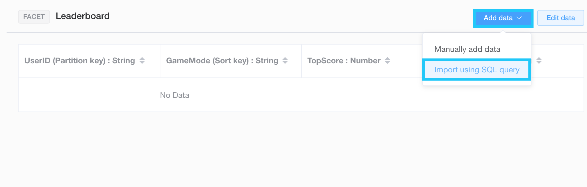
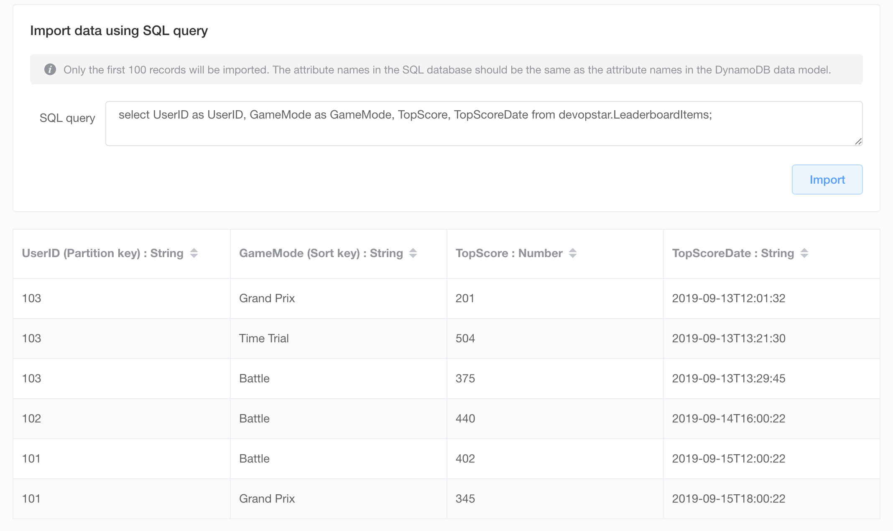

# NoSQL Workbench - Amazon DynamoDB Leaderboard

## Preface

DynamoDB is an AWS fully managed NoSQL database that is well known for being very simple to use. This simplicity is great for newcomers, as long as the problem being solved doesn't require complex schemas. Issues arise for most people when trying to design systems with multiple tables in mind. This is usually where working with DynamoDB can become very complicated for newcomers.

In this post we will be covering off how you can make use of Amazon's new NoSQL Workbench tool to design DynamoDB schemas.

## Goal

Throughout this post are going to be building a game leaderboard system on DynamoDB. This problem might seem simple, however there is some hidden complexity that will soon be apparent. To accomplish this we'll work through the following steps.

* Download & Setup NoSQL Workbench
* Design a DynamoDB Table
* Import data using the SQL Import feature
* Create a Global Secondary Index to retrive high scores

## NoSQL Workbench

[NoSQL Workbench can be downloaded from here](https://docs.aws.amazon.com/amazondynamodb/latest/developerguide/workbench.settingup.html) and is available on both Mac & Windows.

**Note**: *Unfortunately there is no Linux client yet*

Once installed open it up and have a look through the main interface


### Design a Schema

Let's say that you are a mobile game startup that had created a very successful video game called **AppleKart**. AppleKart has a variety of game modes:

* Grand Prix
* Time Trial
* Battle

Each of these modes have a multiplayer aspect in the format of a global scoreboard. We'd like to keep the data we're working with simple so it was decided that the unique key would be the users identifier (UserID). The problem we're faced with is that a score field needs to be stored for each game mode for each user.

First thought might be to do something seen below:


The problem here is that UserID is the only unique key we are given. When adding a new entry for a different game mode the previous entry will be overridden. Traditionally we probably would end up using a separate table for each game mode, however we aren't given this luxury in NoSQL land.

Instead we're able to make use of a Sort Key; which when paired with the primary key makes the entry unique.


### Create Data Model

With the previous information in mind let's design a simple model using NoSQL Workbench. Start off by creating a new data model by *clicking* the button up the top of the Data modeler.


Next we can define our table attributes:

* **Table name**: Leaderboard
* **Primary key**: UserID *{String}*
* **Sort key**: GameMode *{String}*
* **Other attributes**:
  * **TopScore** *{Number}*
  * **TopScoreDate** *{String}*


Create the table based on the inputs above and we'll move onto adding some data

### Importing Sample Data

With the table model setup it's time to import some data to play with. To begin with navigate to the NoSQL Workbench Visualizer and select your `Leaderboard` table

Start by having a go manually importing data and you'll soon grow tired at the thought of having to add these by hand.


Luckily there's a second option to import using SQL queries. I've gone ahead and included a dockerized way of running a simple SQL server with data already.

**Note**: *Docker & docker-compose will be required for this step*

First pull down a copy of this repository and change into the directory

```bash
git clone https://github.com/t04glovern/aws-dynamodb-leaderboard
cd aws-dynamodb-leaderboard
```

Then use `docker-compose up -d` to bring up the SQL container followed by `docker ps -a` to view the status.

```bash
docker-compose up -d
# Creating network "aws-dynamodb-leaderboard_default" with the default driver
# Pulling db (mysql:5.7)...
# 5.7: Pulling from library/mysql
# 8f91359f1fff: Pull complete
# 6bbb1c853362: Pull complete
# e6e554c0af6f: Pull complete
# f391c1a77330: Pull complete
# 414a8a88eabc: Pull complete
# fee78658f4dd: Pull complete
# 9568f6bff01b: Pull complete
# 76041efb6f83: Pull complete
# ea54dbd83183: Pull complete
# 566857d8f022: Pull complete
# 01c09495c6e7: Pull complete
# Digest: sha256:f7985e36c668bb862a0e506f4ef9acdd1254cdf690469816f99633898895f7fa
# Status: Downloaded newer image for mysql:5.7
# Creating aws-dynamodb-leaderboard_db_1 ... done

docker ps -a
# CONTAINER ID        IMAGE               COMMAND                  CREATED             STATUS              PORTS                               NAMES
# f3430e53ff51        mysql:5.7           "docker-entrypoint.s…"   18 seconds ago      Up 17 seconds       0.0.0.0:3306->3306/tcp, 33060/tcp   aws-dynamodb-leaderboard_db_1
```

Head back to NoSQL Workbench and now open import data from SQL database.



You to define a statement to be run in-order to import the data. In our case it can be found below

```sql
select UserID as UserID, GameMode as GameMode, TopScore, TopScoreDate from devopstar.LeaderboardItems;
```

I've included an example of how to remap keys by using the `as` operator. Click Import to proceed to the next modal that will prompt for SQL connection details

* **Database**: MySQL
* **Hostname**: localhost
* **User Name**: devopstar
* **Password**: devopstar


Once you receive the success prompt you can click `Import` again to view the results of the query



Check that the data imported successfully by clicking `Update` then `Aggregate view` on the Visualizer tab


### Global Secondary Index

Although it might look impressive we have yet to solve any major problems. The main issue we will inevitably face is **how to retrieve the top score of a given game mode?**

This is another example of where people might go and use a second table for rankings. Instead of doing that, we can make use of Global Secondary Indexes (GSI) to create a different way of accessing our data. Seen below is how we can accomplish this:


This index will allow us to sort TopScore attributes for each given game mode. Let's edit our existing model to include the new index


Create a new GSI and setup the schema as follows


Save the changes and if you navigate back to the Visualizer you should see the GSI in action


**Note**: There appears to be a NoSQL Workbench bug when trying to render this GSI. It might be fixed in the future however for now you can see what it would look based on the committed schema in DynamoDB below:


## Final Thoughts

You can clean up the running docker container for MySQL by running the following

```bash
docker-compose down -v
```

NoSQL Workbench is a great tool for beginners and experts. It allows you to prototype schema designs in a simple and intuitive way along with acknowledging that data might not already be in NoSQL formats and providing tooling to cater for that.
